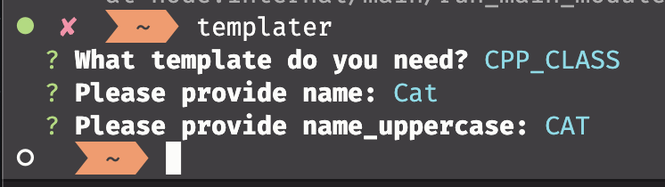

## Motive



<br>

Quickly generate files using an easy to use command line application.
Select one of your templates, answer the questions and in no time the files will be generated.

## How to install
```
$ npm install -g @ruben__nijhuis/motive
```

## Usage
```
$ motive
```

It will then prompt you with what template you need and will ask the corresponding questions

## How to configure your template
Two things are important.

The file name and the file name in the `option.json` match!
There are no missing properties (names in the template or in the `options.json`)
I haven't fully configured error/file checking

An example of an options.json file
```json
{
	"global": {						// Global config will be set for each file
		"questions": [				// Questions are in the `inquirerJS` format
			{
				"type": "input",
				"name": "name",
				"message": "What is the name of the class?"
			}
		],
		"config": {					// Config can be used for setting up the output file name
			"fileName": "{{name}}"	// Because of the braces the program will interpret it as a variable that is already requested
		}
	},
	"files": [						// Config for each file and what template file needs to be used
		{
			"template": "CPP_CLASS_CPP",
			"name": "cpp class",
			"config": {
				"extension": ".cpp"
			}
		},
		{
			"template": "CPP_CLASS_HPP",
			"name": "hpp class",
			"config": {
				"extension": ".hpp"
			}
		}
	]
}

```

Note that any config you have in the 

An example of a template file
```cpp
#include "{{name}}.hpp"
#include <stdio.h>

{{name}}::{{name}}(void)
{
    std::cout << "{{name}} created with an empty construcor" << std::endl;

    this->_type = "{{name}}";

    return;
}

{{name}}::~{{name}}(void)
{
    std::cout << "{{name}} " << this->_type << " deconstructed" << std::endl;
    return;
}

{{name}}::{{name}}(const {{name}}& other)
{
    std::cout << "{{name}} created by copy" << std::endl;
    *this = other;
    return;
}

{{name}}& {{name}}::operator=(const {{name}}& other)
{
    std::cout << "{{name}} created by assertion" << std::endl;

    if (this != &other)
    {
        this->_type = other._type;
    }

    return (*this);
}
```

## TODOS
- Make it easy to host your own templates